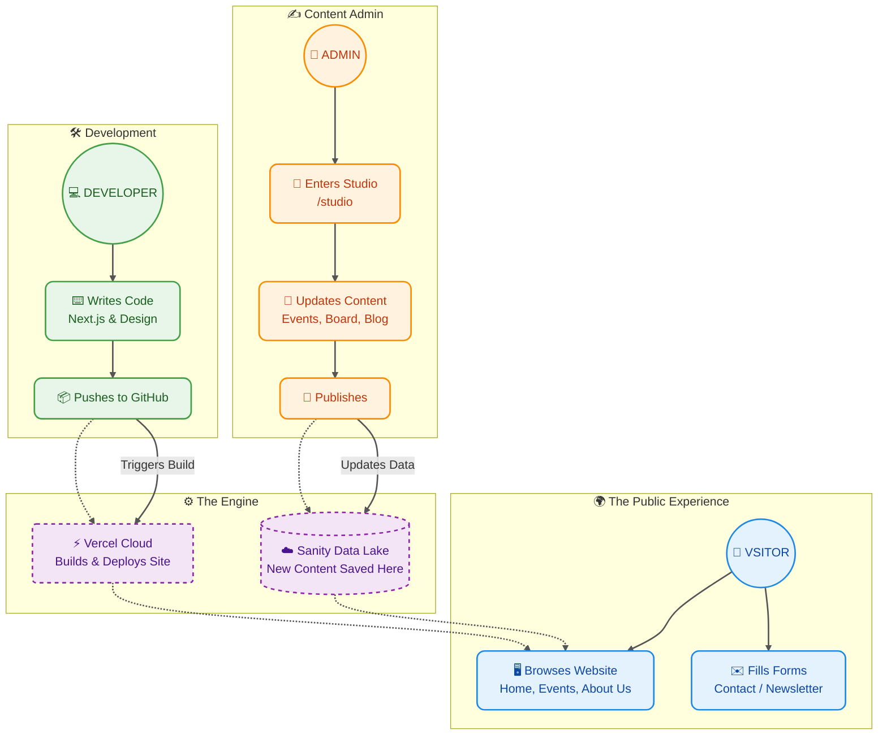

# 🌊 How SAHAHR Works: A Simple Flow

This chart visualizes how Users, Admins, and Developers interact with the SAHAHR platform.

## 🗝️ Key Takeaways

1. **Visitors** enjoy the live site, which pulls fresh content dynamically.
2. **Admins** use the friendly `/studio` interface to add events or edit text without touching code.
3. **Developers** handle the technical side; pushing code changes to GitHub automatically updates the live site via **Vercel**.
4. **Sanity** acts as the central brain for content, feeding data to the website instantly.
